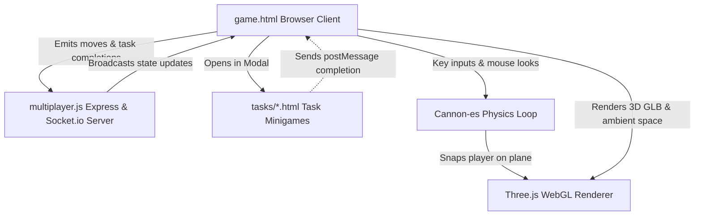
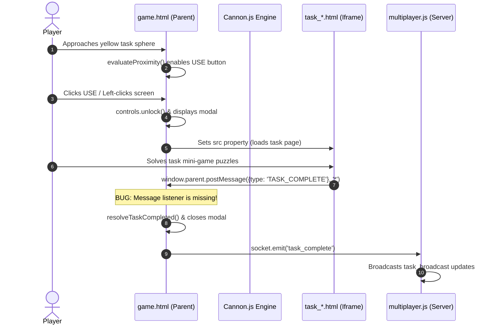

# 3D Among Us Standalone Remake: Codebase Analysis Report

This report presents a thorough analysis of the game's codebase (excluding the `/map_editing_server` utility), detailing its architecture, file structures, gameplay workflows, and key issues requiring remediation to implement features in your `todo.txt`.

---

## 🏛️ Architecture Overview

The codebase is built on a modern hybrid stack that blends standard web layouts with real-time networking, 3D web rendering, and physics simulation:



### 1. Structure & Layout
* **HTML/CSS Overlay System**: The HUD is positioned as screen-space overlay elements (`.hud-layer`, `.cartoon-panel`) on top of a full-viewport WebGL container (`#canvas-container`).
* **Iframe Modal Sandboxing**: Tasks are modular HTML files loaded inside a centered overlay `<iframe>` container (`#modal-overlay`). This separates minigame logic and assets from the main game loop.

### 2. 3D & Physics Pipeline
* **Three.js Graphics**: ACES filmic tone mapping, point lights, fog filters, and vignette layers are combined to build a dark, atmospheric sci-fi space. The Skeld map model (`among_us_-_map_the_skeld.glb`) is loaded dynamically.
* **Cannon-es Collision Engine**: To guarantee player-to-wall boundaries, a physics loop handles player coordinates. Walls from `walls.json` are generated as static boxes inside a 3D gravity-free simulation snapping players to a flat plane ($Y = 5.90$).

### 3. Multiplayer Pipeline
* **Socket.io Hub**: A unified networking pipeline manages room registration, player entries, movement tracking, and task completion broadcasts.

---

## 📁 Project Map & Directory Details

Here is a catalog of files and directories in your codebase:

* **[game.html](file:///c:/Users/conta/Desktop/AmongUs/game.html)**: The primary entry point. Contains client styles, Three.js scene setup, Cannon.js physics loops, PointerLock controls, settings pane, custom UI inputs, and logic evaluating player-to-task coordinates.
* **[multiplayer.js](file:///c:/Users/conta/Desktop/AmongUs/multiplayer.js)**: The Express & Socket.io server script. Serves files, tracks active astronauts, handles real-time lobby state, and handles pipeline networking updates.
* **[task_sets.json](file:///c:/Users/conta/Desktop/AmongUs/task_sets.json)**: Contains the definition of 6 distinct tasks configurations loaded on startup, defining sequential steps for multi-stage tasks.
* **[config.json](file:///c:/Users/conta/Desktop/AmongUs/config.json)**: Holds positioning coordinates, scale details, and rotation values for task interaction spheres and map entities.
* **[walls.json](file:///c:/Users/conta/Desktop/AmongUs/walls.json)**: Extracted coordinates of static walls defining structural collider boundaries.
* **[tasks/](file:///c:/Users/conta/Desktop/AmongUs/tasks/)**: Modular interactive HTML minigames (e.g., `swipe_card.html`, `start_reactor.html`, `shields.html`).
* **[todo.txt](file:///c:/Users/conta/Desktop/AmongUs/todo.txt)**: Development checklist and feature backlog.
* **[among_us_-_map_the_skeld.glb](file:///c:/Users/conta/Desktop/AmongUs/among_us_-_map_the_skeld.glb)**: 3D asset model of the Skeld spaceship.
* **[crewmate_among_us.glb](file:///c:/Users/conta/Desktop/AmongUs/crewmate_among_us.glb)**: 3D model asset of a Crewmate player character.
* **[The_Skeld_blank_map.png](file:///c:/Users/conta/Desktop/AmongUs/The_Skeld_blank_map.png)**: Blank blueprint image map used for the 2D HUD minimap.

---

## ⚙️ Key Workflow Pipelines

### 🛠️ Interactive Tasks Loop

The minigame system relies on post-messaging between the main parent window and the iframe context:



### 🛰️ Movement Synchronizer
* Local movement input (W, A, S, D) creates translation vectors relative to camera orientation.
* These are fed into the local physical body `playerBody.velocity` in the Cannon.js world.
* At the end of the step, the positions of `playerBody`, `playerLight` (spotlight), and the camera are synced, and the new coordinates are emitted to the server via socket.io.
* Other client nodes listen for `player_moved` sockets and perform linear interpolations (`lerp`) to display smooth remote movement.

---

## 🔍 Critical Issues & Bugs Identified

Based on code inspection and comparison with `todo.txt`, we have found several major bugs and gaps:

### 1. 🛑 The Iframe Message Listener Bug (Why tasks don't close)
* **Status**: Critical.
* **Explanation**: All minigames inside `tasks/` trigger a message post back to the parent:
  ```javascript
  window.parent.postMessage({ type: 'TASK_COMPLETE', task: '...' }, '*');
  ```
  However, `game.html` **completely lacks** a `message` event listener on the `window` context. As a result:
  * Task frames never close automatically when solved.
  * `resolveTaskCompleted()` is never executed.
  * Task checklists and progression metrics never check off or advance.
* **Fix**: Insert a message event listener inside `init()` in `game.html` that hooks directly into `resolveTaskCompleted()`.

### 2. 👥 Hemispherical Player Visual placeholders
* **Status**: Gap.
* **Explanation**: The client spawns other players as hemispherical domes:
  ```javascript
  const geo = new THREE.SphereGeometry(playerRadius, 32, 16, 0, Math.PI * 2, 0, Math.PI / 2);
  ```
  The high-quality model `crewmate_among_us.glb` is in the directory, but it is **never loaded or bound** to represent player avatars.
* **Fix**: Integrate a GLTFLoader sub-routine inside `spawnOtherPlayer(p)` to load the `crewmate_among_us.glb` mesh, color it, and sync it to their movement vectors.

### 3. 📡 Missing Task Broadcast Listener on the Client
* **Status**: Gap.
* **Explanation**: The multiplayer server successfully broadcasts verified task completions to all nodes via:
  ```javascript
  io.emit('task_broadcast', { ... });
  ```
  But `game.html` has no socket listener registering `'task_broadcast'`. This prevents users in a lobby from seeing crew progress synchronized in real time.
* **Fix**: Add `socket.on('task_broadcast', (data) => { ... })` to update global metrics on all crewmate screens.

### 4. 🧭 2-Stage Task Sequence Tracking
* **Status**: Gap.
* **Explanation**: As seen in `task_sets.json`, tasks like "Divert Power" are split into a sequence of Stage 1 (Divert) and Stage 2 (Accept). The core client does not currently lock Stage 2 items or enforce completion ordering.
* **Fix**: Modify task activation logic to verify that step sequences are checked off before enabling interaction.

---

## 🚀 Recommended Feature Implementations

To address your requirements in `todo.txt` and expand the game, we recommend adding:

1. **Lobby & Hosting Screen Layouts**:
   * A startup overlay menu to choose Username, avatar color, and selection actions (Host Room, Join Room).
   * Host settings panel to configure: max player count, number of imposters, and mid-game entry rules.
2. **Dynamic Room Management**:
   * Socket event listeners on the server to partition connections into distinct room namespaces (using random codes like `KJAX`).
   * Mid-game join handlers that check the host's room status (allow or lock mid-game players).
3. **Host Migration Routines**:
   * A listener checking for the host socket disconnect. Upon disconnect, the server reassigns the host role to another socket in the room and alerts clients.
4. **Proximity Voice Chat Integrations**:
   * Implement a WebRTC peer connection configuration utilizing coordinates to adjust visual volume and balance panning based on distance between astronauts.
